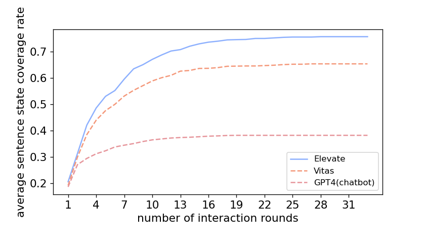
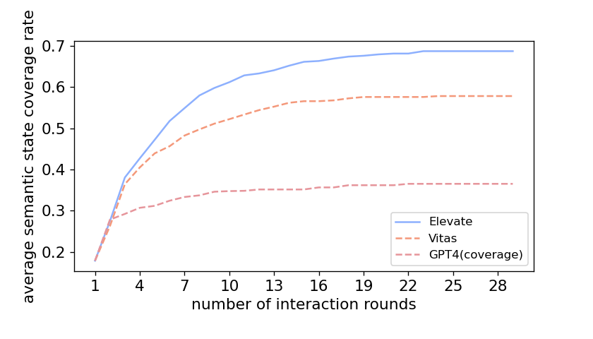
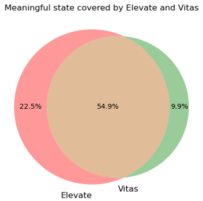

# Coverage metric

## Why using the semantic state coverage rate as metric?

In Study 1, we compare the average semantic state coverage rate with varying interaction rounds between Elevate and baselines. 
Semantic states are acquired by merging sentences with similar functionalities or behavior.
Hence, the number of semantic states represents skill's distinct functionalities.
Using semanic state coverage rate as a metric can better reflect testers' testing sufficiency.

## Why using Observer rather than human inspection as the ground-truth of semantic states?

We calculate the accuracy of Observer in extracting semantic states on the benchmark.
The accuracy for Observer's initial classfication is 88.1%.
After the second check of the state filter, the accuracy increases to 97.5%.
As it costs much labour and time to get the ground-truth of 4000 apps's semantic states, we use the semantic states classified by Observer as the metric.

## Other metric: Sentence state
To demonstrate that Elevate outperforms baselines under different metrics, we compare the average **sentence state** coverage rate with varying interaction rounds in this study. 
The total state space is set as the unique sentence states achieved by Elevate and baselines. 
The result is shown below.

Under the metric of sentence states, Elevate still achieves around 15% higher average coverage rate than Vitas in a more efficient manner.

## Total state space: including states of manual testing
In our paper, the total state space is set as the unique semantic states achieved by Elevate and baselines.
To get a more accurate total state space, we include the state space achieved by **manual testing** in this study.
Then, the semantic state coverage rate with varying interaction rounds is compared between Elevate and baselines.
The result is shown below.

When manual testing results are considered in the total state space, only the denominator to calculate the semantic state coverage rate is changed.
The performance of testers is almost the same as that shown in the study 1.
Elevage still achieves an average coverage rate of nearly 70% and supasses baselines.

## Analyze the feature of state space achieved by Elevate, Vitas and Manual testing

If we take the manual testing results as a comparison, we can learn the similarity of Elevate and Vitas's behavior with the human tester.
We draw the venn diagram to show the intersection state space between Elevate, Vitas and Manual testing.
The text on each part represents the state space coverage rate when the unique states achieved by Elevate, Vitas and Manual testing is set as the total space.
The result is shown below.

Compared with Vitas, Elevate covers more state space discovered by manual testing, which proves that Elevate works more like a manual tester.
This result is in line with our expectations, as Elevate's three agents commit to complementing the semantic loss during VUI testing.
To further analyze the characteristics of states achieved by Elevate and Vitas, we extract meaningful states, which represent the normal behavior of skills.
Meaningful states are extracted manually from the states achieved by Elevate and Vitas.
The venn diagram of meaningful states coverage by Elevate and Vitas is shown below.

The figure demonstrate that Elevate achieves more meaningful states than Vitas. 
It proves that input events generated by Elevate are more effective in exploring apps' functionalities.