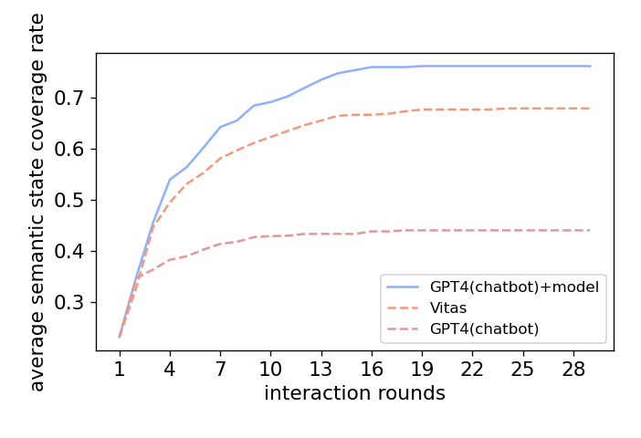

# Effectiveness

## The benefit of embedding the behavior model into prompts
Elevate is essentially a model-based testing(MBT) method.
All agents work around the behavior model.
Consequently, taking behavior model as the input is the requirement of tasks.
If there is no behavior model guidance, the LLM will degenerate into a chatbot style tester.
To prove the effectiveness of embedding the behavior model into prompts, we compare GPT-4 with and without behavior model as prompt. 
GPT-4 without behavior model is represented as GPT4(chatbot), and GPT-4 with behavior model in prompts is represented as GPT4(chatbot)+model.
The semantic state coverage rate acquired by GPT4(chatbot), GPT4(chatbot)+model and Vitas is shown below.

The result demonstrates that the behavior model provides effective testing information and improves the coverage of pure LLM in over 30%. 
Besides, GPT-4 with behavior model as prompts has advantages over traditional MBT method Vitas.

## Impact of LLM variance on Elevate

To study the impact of the LLM's different versions on Elevate's performance, we implement Elevate based on GPT4-turbo-2024-04-09 and compare to Elevate implemented on GPT4-1106-Preview (Elevate in the paper).
The semantic state coverage rate of two Elevate's versions and baselines is shown below.

The curves of coverage with interaction rounds acquired by two Elevate's versions are almost coincidental.
They have both around 20% more coverage than Vitas, and over 35% more coverage than GPT4(chatbot).
The result proves that LLMs' versions has no impact on Elevate's performance.