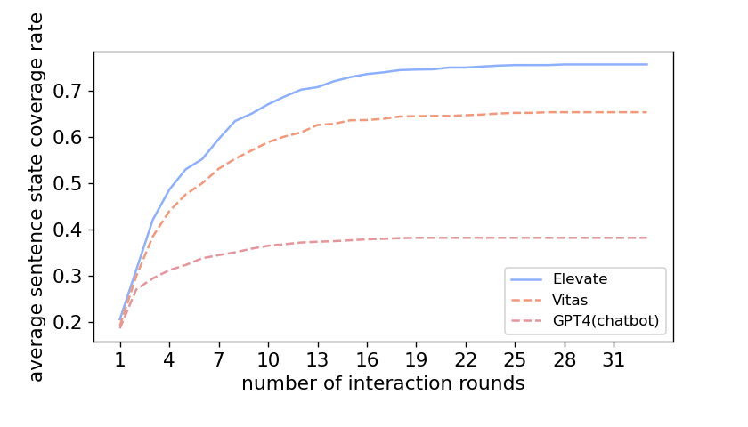
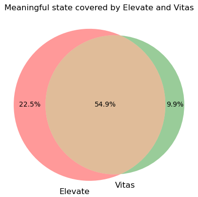
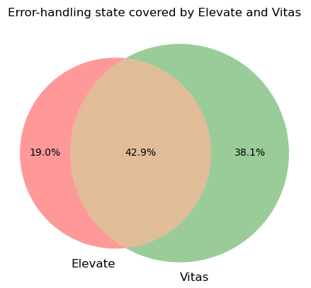

# Extra Experiment

## Average sentence state coverage rate with interaction rounds

In Study 1, we compare the average semantic state coverage rate with varying interaction rounds between Elevate and baselines. Semantic states are acquired by merging sentence states with similar functionalities or behavior. To show that Elevate performs better under different metrics, we compare the average **sentence state** coverage rate with varying interaction rounds between Elevate and baselines in this study. The total state space is set as the unique sentence states achieved by Elevate and baselines. The result is shown below.

Under the metric of sentence states, Elevate still achieves 10% higher average coverage rate than Vitas in a more efficient manner.

## Average semantic state coverage rate with interaction rounds (total state space includes states of manual testing)

In Study 1, only the unique states achieved by Elevate and baselines form the total state space. We agree that manual testing results are significant in measuring the total state space when the ground truth is unknown. So we add **the manual testing results to the total state space** and compare the semantic state coverage rate with varying interaction rounds between Elevate and baselines. The results is shown below.

When manual testing results are considered in the total state space, Elevage still achieves an average coverage rate of nearly 70%.

## Problems found by Elevate on 4000 skills

As summaried by Vitas, five common problems exist on VPA apps: unexpected exit, privacy violation, unable to exit, expected started apps and unavailable apps. Hence, Elevate supports checking these five problems while exploring VPA apps' behavior. The problems found on the large scale dataset by Elevate is shown below.

| category | apps with problems | unexpected exit | privacy violation | unable to exit | expected started apps | unavailable apps |
| ---- | ---- | ---- | ---- | ---- | ---- | ---- |
| Business_Finance | 187 | 121 | 11 | 13 | 6 | 55 |
| Connected_Car | 15 | 5 | 1 | 2 | 0 | 8 | 
| Education_Reference | 330 | 209 | 8 | 8 | 25 | 105 | 
| Food_Drink | 167 | 123 | 5 | 7 | 3 | 39 | 
| Games_Trivia | 453 | 207 | 7 | 12 | 27 | 230 | 
| Health_Fitness | 106 | 62 | 2 | 0 | 8 | 39 | 
| Kids | 161 | 37 | 1 | 0 | 14 | 117 | 
| Lifestyle | 334 | 199 | 10 | 5 | 18 | 118 | 
| Local | 17 | 11 | 0 | 0 | 0 | 6 | 
| Movies_TV | 20 | 11 | 0 | 1 | 2 | 8 | 
| Music_Audio | 2 | 2 | 0 | 0 | 0 | 0 | 
| News | 132 | 87 | 0 | 3 | 6 | 41 | 
| Novelty_Humor | 600 | 436 | 7 | 6 | 29 | 138 | 
| Productivity | 158 | 85 | 7 | 16 | 9 | 59 | 
| Shopping | 55 | 28 | 4 | 3 | 1 | 21 | 
| Smart_Home | 346 | 90 | 2 | 36 | 9 | 263 | 
| Social | 171 | 85 | 5 | 5 | 14 | 72 | 
| Sports | 58 | 22 | 1 | 0 | 7 | 30 | 
| Travel_Transportation | 110 | 61 | 2 | 7 | 3 | 44 | 
| Utilities | 137 | 81 | 5 | 7 | 9 | 47 | 
| Weather | 72 | 46 | 3 | 3 | 4 | 20 | 
| Total | 3631 | 2008 | 81 | 134 | 194 | 1460 | 

Surprisingly, 1654 skills (41.5%) are unavailable. Among the rest 2346 skills, most of them are detected with unexpected exit.

## Comparison of state space achieved by Elevate, Vitas and Manual testing

To show the intersaction state space between Elevate, Vitas and Manual testing, we draw the venn diagram. The text on each part represents the state space coverage rate when the unique state space of Elevate, Vitas and Munual testing is set as the total space. The result is shown below.

Compared with Vitas, Elevate covers more state space discovered by manual testing, which proves that Elevate is more effective in covering meaningful states and works more like a manual tester.

To further explore the features of states achieved by Elevate and Vitas, we classify the states into two categories, they are meaningful states and error-handling states.
Among them, meaningful states represent the behavior of skills providing normal service, while error-handling states represent skills failing to understand the user's inputs.
Then, we manually classify the states achieved by Elevate and Vitas into meaningful or error-handling states, and draw two venn diagrams below.

From these two figures, we can see that Elevate achieves more meaningful states than Vitas, while Vitas achieves more error-handling states than Elevate. It proves that input events generated by Elevate is more effective in exploring apps' functionalities.

