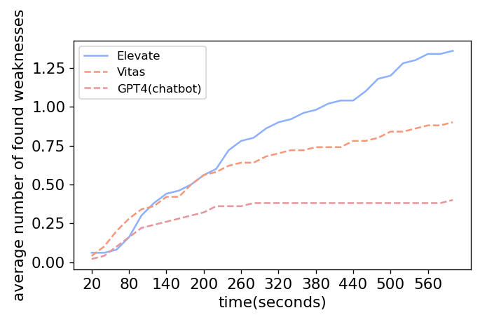

# Weaknesses

## Number of weaknesses detected by Elevate and Vitas on the benchmark
The benchmark contains available and stable Alexa skills.
However, they also suffer from problems including unexpected exit, privacy violation and unstoppable problems.
While Elevate and baselines tested these skills, they recorded these problems.
The number of unique weaknesses found by Elevate and baselines with time is shown below.

The number of weaknesses detected with time is proportional to the increase of the state space with interaction rounds.
We notice that weaknesses found by Elevate are fewer than baselines in the first two minutes.
The reason is that Generator tends to generate meaningful inputs and Planner prefers to choose the context-related input, which are closer to natural language (see [coverage features](coverage.md#analyze-the-feature-of-state-space-achieved-by-elevate-vitas-and-manual-testing)).
These context-related inputs help us dig out skills' deeper behavior.
After multiple rounds of effective interactions, Elevate can find more hidden problems.

As a comparison, the inputs chose by baselines lack context relavance or the natural language format.
As skills have difficulty understanding these inputs, they are more likely to expose problems.
However, as these inputs cannot help find deeper functionalities, baselines continue to discover shallow problems repeatly.
What's more, as users rarely deliberately say strange words during use, problems found by baselines are less likely to happen in practice.

## Weaknesses found by Elevate on 4000 skills

Vitas summarized five common problems on VPA apps: unexpected exit, privacy violation, unable to exit, expected started apps and unavailable apps.
Elevate supports checking these problems while exploring VPA apps' behavior.

To show Elevate's applicability on real-world apps, Elevate tested the 4000 skills in the large-scale dataset.
The information of these 4000 skills comes from Vitas's benchmark, but the skills under test is the latest version on the Alexa skill store.
The number of apps with various problems found by Elevate is shown below.

| category | unexpected exit | privacy violation | unable to exit | expected started apps | unavailable apps |
| ---- | ---- | ---- | ---- | ---- | ---- |
| Business_Finance |121 | 11 | 13 | 6 | 55 |
| Connected_Car | 5 | 1 | 2 | 0 | 8 | 
| Education_Reference | 209 | 8 | 8 | 25 | 105 | 
| Food_Drink | 123 | 5 | 7 | 3 | 39 | 
| Games_Trivia | 207 | 7 | 12 | 27 | 230 | 
| Health_Fitness | 62 | 2 | 0 | 8 | 39 | 
| Kids | 37 | 1 | 0 | 14 | 117 | 
| Lifestyle | 199 | 10 | 5 | 18 | 118 | 
| Local | 11 | 0 | 0 | 0 | 6 | 
| Movies_TV | 11 | 0 | 1 | 2 | 8 | 
| Music_Audio | 2 | 0 | 0 | 0 | 0 | 
| News | 87 | 0 | 3 | 6 | 41 | 
| Novelty_Humor | 436 | 7 | 6 | 29 | 138 | 
| Productivity | 85 | 7 | 16 | 9 | 59 | 
| Shopping | 28 | 4 | 3 | 1 | 21 | 
| Smart_Home | 90 | 2 | 36 | 9 | 263 | 
| Social | 85 | 5 | 5 | 14 | 72 | 
| Sports | 22 | 1 | 0 | 7 | 30 | 
| Travel_Transportation | 61 | 2 | 7 | 3 | 44 | 
| Utilities | 81 | 5 | 7 | 9 | 47 | 
| Weather | 46 | 3 | 3 | 4 | 20 | 
| Total | 2008 | 81 | 134 | 194 | 1460 | 

Surprisingly, most of skills are detected with problems.
The problems found by Elevate cover those discovered by Vitas.
In addition, Elevate found over a half of skills suffer from unexpected exit.
Approximately 2% of skills have privacy violation issues.

## Applicability on top real-world apps
To further prove that our method has applicability and generality, we choose the top 60 skills with most rating number (util February, 2024).
The below table shows the number of real-world apps with problems found by Elevate.

| problem type |unexpected exit | privacy violation | unable to exit | expected started apps | unavailable apps |
| ---- | ---- | ---- | ---- | ---- | ---- |
| number | 36 | 2 | 3 | 4 | 14 | 

The result shows that Elevate found at least 59.0% of apps with unexpected exit and 3.3% of apps with privacy violation.
Even apps with a large number of users suffer from various problems.
This finding not only proves the applicability of Elevate, but also draws our attention to the quality of VPA apps.

Besides, there are 31.1% of apps that cannot be correctly visited, including expected started apps and unavailable apps.
Skills' iteration is quite fast as almost one-third of apps cannot launch within ten months.